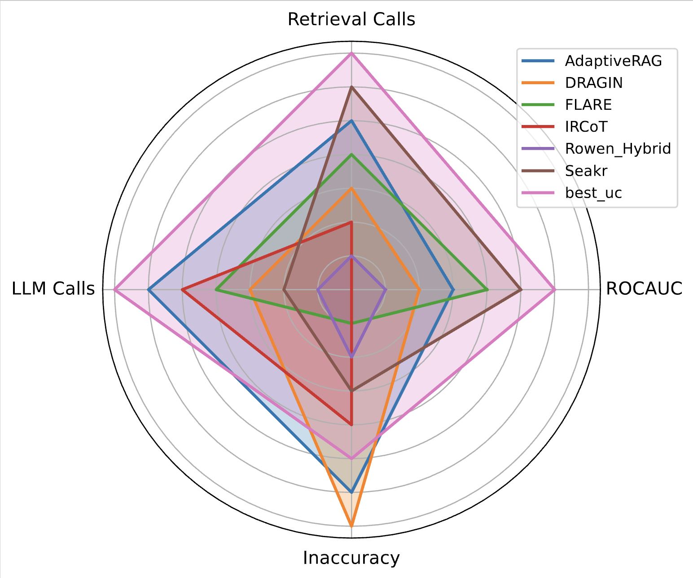
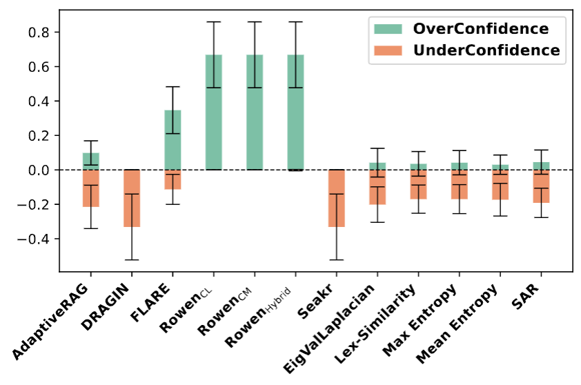

# This is repository for AdaRAG experiments

To use methods and reproduce the results you need:
* Run the retriever
* Use one of the methods below

# Retriever
Followed by [dragin](https://github.com/oneal2000/DRAGIN) and [SeaKR](https://github.com/THU-KEG/SeaKR). Use the Wikipedia dump and elastic search to build the retriever
All info about how to run a retriever is available in [README.md](./standard_retriever/README.md).

You can use your own retriever.

# Methods
## IRCoT

## Adaptive RAG

## FLARE and DRAGIN

All code with our evaluator and dependencpy installation is available in `DRAGIN` folder. We copied the original DRAGIN repository. For running experiments with FLARE and DRAGIN use a code from DRAGIN [README.md](./dragin/README.md)

## Rowen

Install all required dependences from `rowen/pyproject.toml` and use `run.sh` to reproduce results. More details in [Rowen README.md](./rowen/README.md)

## SeaKR

All code with our evaluator and dependencpy installation is available in `SeaKR` folder. We copied the original SeaKR repository and made some in `vllm_uncertainty`. For running experiments use a code from [SeaKR README.md](./SeaKR/README.md)

## Uncertainty Estimation Methods

Install all required dependences from `UC/requirements.txt` and use scripts from `bin/*.sh` to reproduce results. More details in [UC README.md](./UC/README.md)

# What to choose & Results
First, take a look to our radar
 

Secondly, take a look on over/underconfidence of methods and choose the appropriate one depends on a task
 